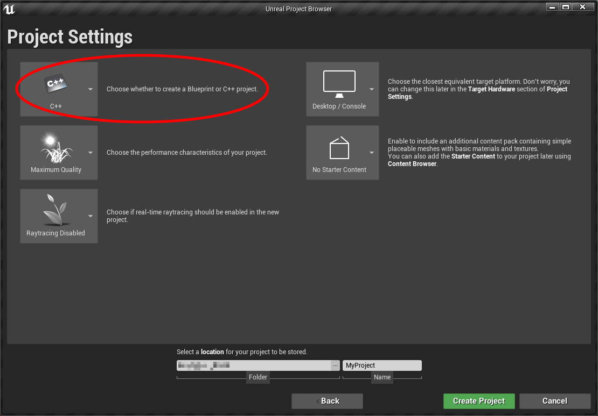
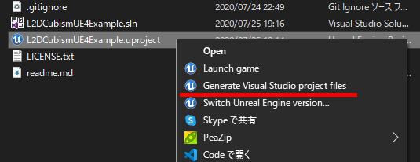

# インストール

プラグインですので、UE4のプロジェクトにコピーして利用します。

## 利用環境

下記のバージョンを利用します。

- UE4.24
- VisualStudio 2017
- [Cubism SDK for Native]((https://www.live2d.com/download/cubism-sdk/download-native/))

## UE4のプロジェクトを作成

事前にUE4のプロジェクトを作成します。プロジェクトはC++ベースで作成してください。



## ソースコードを取得

ソースコードを取得します。プラグインのフォルダ名はL2Cubismとしてください。

```
> cd 【UE4project】
> mkdir Plugins
> cd Plugins
> git clone https://github.com/demuyan/L2DCubismUE4 L2DCubism
```

## Cubism SDKをセットアップする

ビルドには、[CubismSDK for Native](https://www.live2d.com/download/cubism-sdk/download-native/)が必須なので、ダウンロードしておきます（使用許諾契約の確認をお忘れ無く）。

このドキュメントは、CubismSDK for Native R1の利用を前提に解説を進めます。

本プラグインをビルドするには、あらかじめCubismSDKのヘッダファイル、ライブラリ、フレームワークをプラグインの特定のフォルダにコピーしておかなければなりません。

セットアップの手段には、次の2つの方法があります。いずれかの方法でセットアップを行って下さい。

 - バッチファイルを実行する
 - 手動でファイルをコピー

### バッチファイルを実行する

本プラグイン内にあるsetupcubismsdk.batファイルを利用する方法です。

手順は以下の通りです。
 1. ダウンロードしたCubism SDKのzipファイル(CubismSdkForNative-4-r.1.zip)をプラグインのルートディレクトリにコピーする
 2. 同じ階層フォルダにあるsetupcubismsdk.batファイルを実行する

batファイル実行後は、ライブラリ、ヘッダ、フレームワークが所定の位置にコピーされます。

コマンドで実行する場合は次のようになります。

```
> copy CubismSdkForNative-4-r.1.zip 【UE4project】\Plugins\L2DCubism\
> cd 【UE4project】\Plugins\L2DCubism\
> setupcubismsdk.bat
```

### 手動でファイルをコピー

セットアップは手動でも行えます。バッチファイルを実行してもうまくいかない場合などはこちらの方法でセットアップしてください。

CubismSdkForNative-4-r.1.zipファイルを展開した後、次のようにコピーを行います。

- Coreフォルダは、Plugins\L2DCubism\Source\ThirdParty\SDKフォルダへコピー
- Frameworkフォルダは、Plugins\L2DCubism\Source\L2DCubism\SDKへコピー

コマンドで実行する場合は次のようになります。

```
> cd (CubismSdkForNative-4-r.1.zipを展開したフォルダ)
> copy Core 【UE4project】\Plugins\L2DCubism\Source\ThirdParty\SDK
> copy Framework 【UE4project】\Plugins\L2DCubism\Source\L2DCubism\SDK
```

## フレームワークのソースコードを書き換える

Source/L2DCubism/SDK/Framework/src/Model/CubismUserModel.hppファイルの292行目を「private:」→「public:」へ変更します。

### 変更前

```
private:
    Rendering::CubismRenderer* _renderer;       ///< レンダラ
};
```

### 変更後
```
public:  // <- この行を書き換える
    Rendering::CubismRenderer* _renderer;       ///< レンダラ
};
```

## .slnファイルを作り直す

.uprojectファイルを右クリック、"Generate Visual Studio project files"を選択、実行します。



## .slnファイルを実行する

あとは、VisualStudio 2017を起動し、.slnファイルをオープン・実行します。
UE4エディタ起動時にはプラグインが有効化されています。
